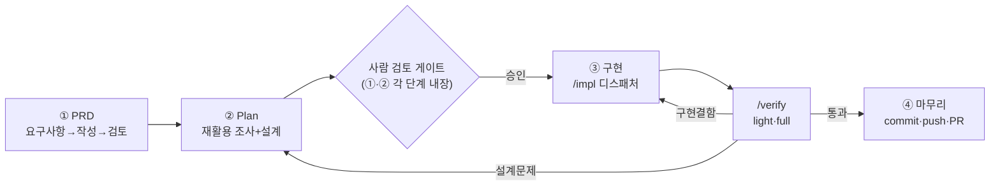

## 요약
<!-- 이 PR이 무엇을, 왜 바꾸는지 1~3줄 -->

## 개발 흐름
<!-- 이 PR이 거친 OS 개발 흐름. GitHub가 아래 mermaid를 다이어그램으로 그려줌(리뷰 시 흐름 파악용). 이 섹션은 항상 포함된다. -->

## 변경 내용
<!-- 주요 변경을 항목으로. 커밋 단순 나열이 아니라 "무엇이 왜" -->
-

## 테스트
<!-- 어떻게 검증했는지 / 테스트 결과 (예: pytest 23/23). 모르면 "확인 필요" -->
-

## 관련
<!-- 관련 이슈·문서 링크 (선택) -->
-
